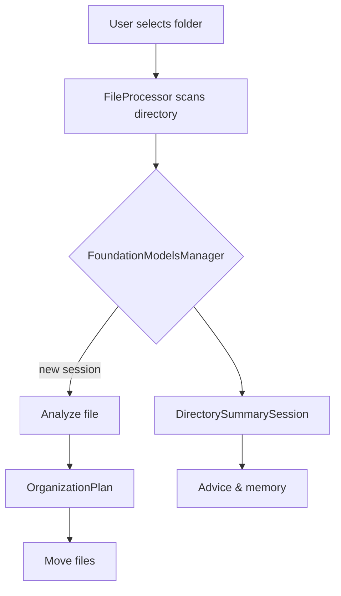

# Architecture Notes

This project is intentionally lightweight.  The `analyze_dependencies.py` script generates a dependency graph and summary in `architecture_summary.md`.  Below is a placeholder Mermaid diagram of the high level flow.

